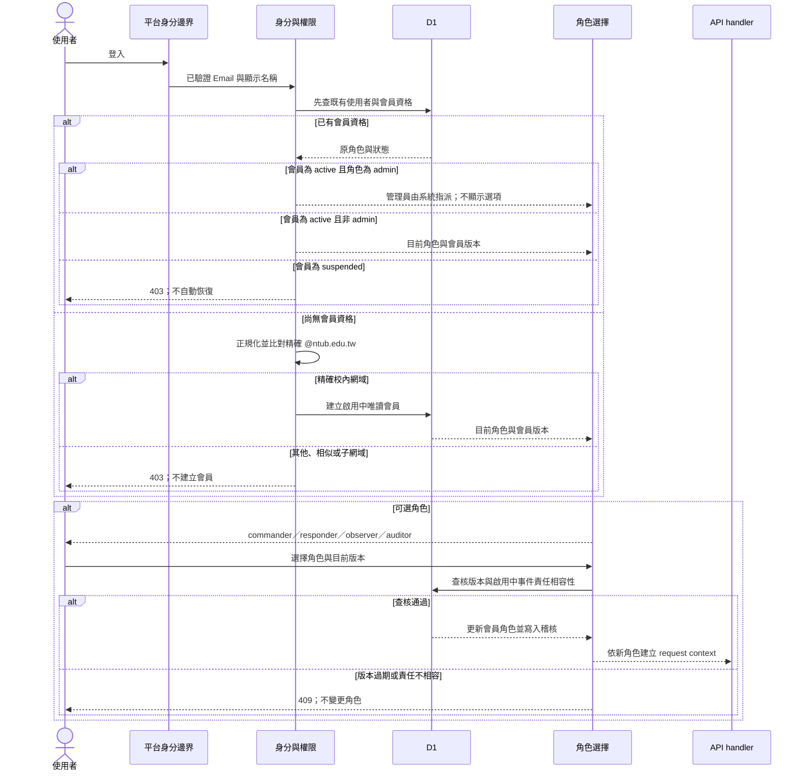
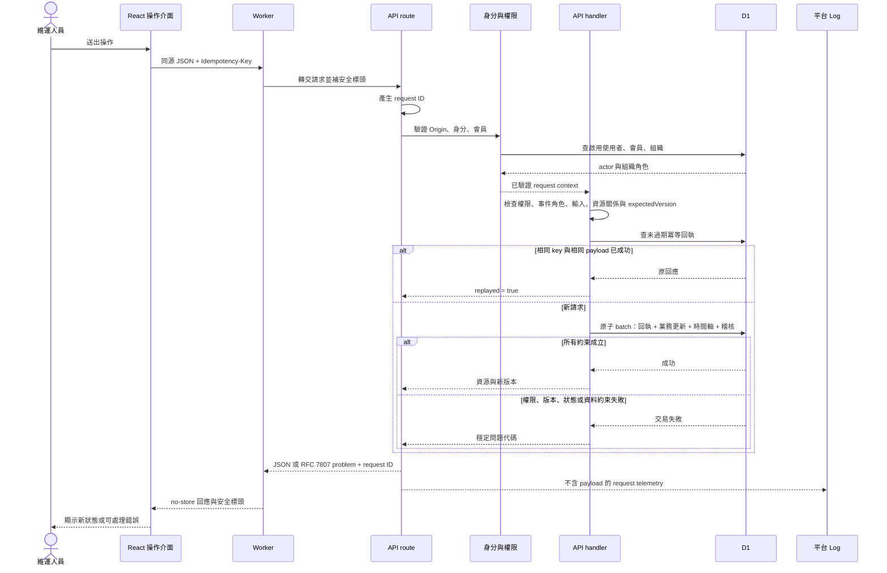
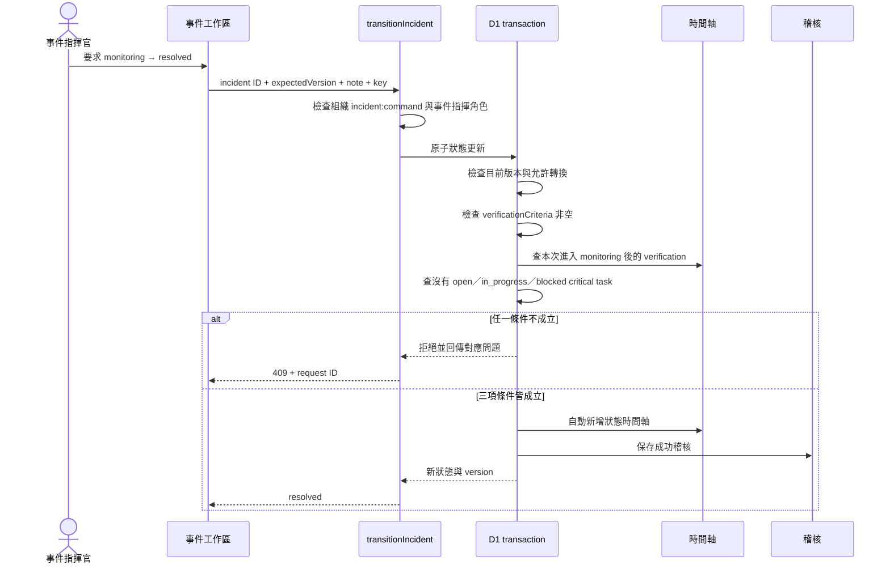
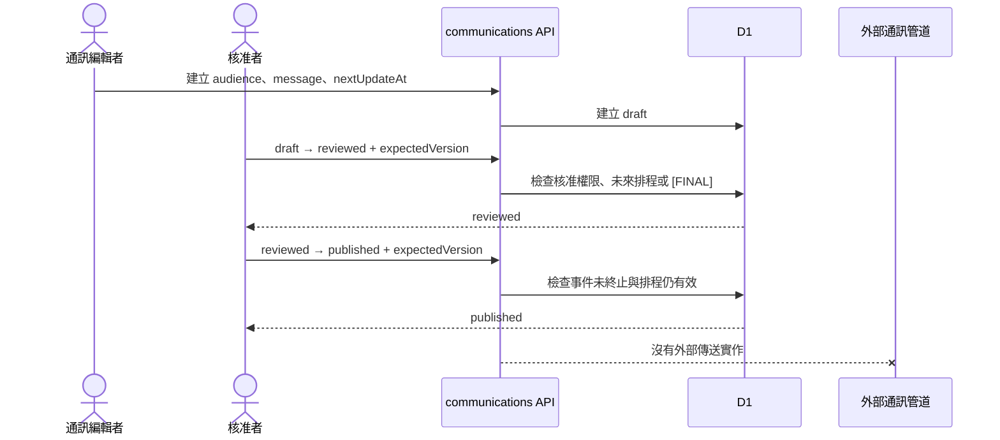
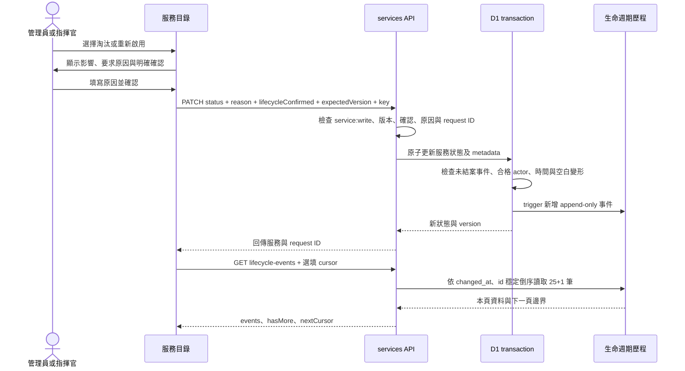

# Continuity Ops 核心請求與資料流程

文件版本：`1.0.0`  
狀態：`source_confirmed`。校內帳號建立、角色選項、管理員排除與角色切換已有隔離本機 Worker／D1 的 `verified_local_controlled` 結果；正式身分邊界仍須以實際第二個 NTUB 帳號確認。

## 1. 正式身分解析與校內角色選擇

`admin` 不在可選角色清單中，自選 API 也會拒絕該值。`observer` 與 `auditor` 的存取政策回應只包含本人，不包含成員目錄；其稽核回應不包含 actor email。這些限制與角色切換都在伺服器端執行，不能只靠畫面隱藏欄位或按鈕。

## 2. 一般寫入請求

錯誤處理重點：API route 的 telemetry 失敗不能改變原回應；可信 actor 已建立後的特定 mutation 拒絕會嘗試另存 payload-free audit。若該 audit 寫入也失敗，系統另發結構化 error telemetry，但目前沒有正式收集與告警證據。

## 3. 事件解決

2.2.0 的 migration 正反例與指定 Worker 的 71/71 項 API smoke 已在隔離本機 D1 通過；本機 API 證據綁定 Worker SHA-256 `e725a8a8c1cb9b0b41a1b478e6ad0ca6b11c515d673e051ced27c6c92429cedd`。同一 digest 的內部受控瀏覽器查核涵蓋桌面與手機尺寸、深層連結、鍵盤分頁切換、瀏覽器前進後退，以及 dialog／drawer 焦點；axe-core 選定規則為 0 violation、0 incomplete。本輪未重跑兩分頁輪詢。這些結果只支持明列的本機 API→D1 與瀏覽器流程，不是正式獨立人員 QA、外部使用者證據、完整 WCAG 符合性、自動 E2E、遠端環境或外部服務恢復證據。verification 內容的真實性仍由操作者、獨立 QA 與外部證據查核。

## 4. 通訊審核與標記發布

`published` 是產品內部狀態。除非日後加入並驗證外部 connector、重試、失敗處理與送達回執，任何報告都不能把它寫成已寄出、已發布到狀態頁或已送達。

## 5. 服務淘汰、重新啟用與歷程查核

狀態未改時不能單獨改寫生命週期 metadata；歷程列不能更新或刪除。舊淘汰資料沒有原始理由時保持空值，日後真實重新啟用才新增第一筆事件。0004 migration、簽章 cursor 單元案例及指定 2.2.0 API artifact 的多頁讀取已在本機通過；內部桌面瀏覽器也已核對 25+2 分頁與高風險確認。遠端、行動裝置與獨立 QA 仍未驗證。

## 6. UI 讀取與更新

- `/operations?view=incidents&incident=...&tab=...` 將選取狀態保存在 URL，重新整理及瀏覽器前進／後退可還原。
- 畫面可見且沒有 mutation 進行時，選取事件明細採約 8 秒週期查詢，總覽採約 30 秒週期；頁面重新可見時會再讀取。
- 這是週期性查詢，不是即時推播。QA 應記錄實際觀察延遲，不得只寫「即時更新」。
- 深層連結只保存 UI 選取資訊；資料是否可讀仍由 API 身分、組織與事件授權決定。

## 7. request ID 如何串起證據

同一 mutation 的 request ID 應出現在 API 回應 header／body、request telemetry、成功或可判定拒絕的 audit，以及部分時間軸事件。診斷時先用 request ID 縮小範圍，再核對 actor、route template、問題代碼、資源 version、時間軸與 D1 狀態。不得把 request body 或秘密加入 Log 來換取方便。
