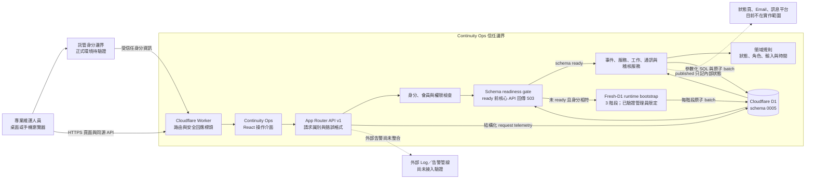

# Continuity Ops 系統環境、元件與責任邊界

文件版本：`1.0.0`  
狀態：依目前原始碼、本機 migration 與受控 runtime-bootstrap 結果整理。新的校內帳號建立與唯讀資料最小化為 `source_confirmed`，並有範圍受限的 `verified_local_controlled` 結果；正式託管身分、Log 管線及生產 D1 尚未驗證。

## 1. 系統環境

虛線表示規劃中的外部能力，不表示已完成整合。正式環境的受信任身分資訊只能由受保護的 identity edge 加入；直接由一般用戶端提供相同 header 不能被視為可信。

## 2. 元件責任

| 元件 | 主要責任 | 不負責的事項 | 原始碼或設定 |
|---|---|---|---|
| 操作介面 | 顯示總覽、事件、服務、稽核與存取管理；依權限顯示操作；保存網址狀態；提供確認與錯誤回饋。 | 不能成為授權或資料不變條件的唯一保護。 | `app/operations/OperationsApp.tsx`、`app/globals.css` |
| Worker 邊緣入口 | 將請求交給應用程式、處理圖片、補上 CSP、frame、MIME、referrer、permissions 等回應標頭。 | 不在原始碼中驗證託管身分 header 的上游防偽設定。 | `worker/index.ts` |
| API 路由 | 產生 request ID、統一 dispatch、回傳 JSON 或 RFC 7807 問題，並保存不含 payload 或身分資料的 request telemetry。 | D1 保存不代表已有外部告警、長期保存政策或平台級監控。 | `app/api/v1/[...path]/route.ts`、`app/api/v1/_shared.ts`、`db/operations-telemetry.ts` |
| 身分與權限 | 區分本機明確設定與正式 forwarded identity；為精確 `ntub.edu.tw` 帳號建立安全的初始唯讀會員；提供四種非管理員角色選擇；檢查版本、事件指派相容性、組織權限、HTTP method 與角色別回應欄位。 | 平台已驗證不等於取得任意權限；前端顯示不等於授權；不得開放自選 `admin`，也不得恢復既有 `suspended` 使用者或會員。 | `lib/operations-auth.ts`、`db/operations.ts`、`lib/operations-domain.ts` |
| Schema readiness | 核對 durable phase、schema version、plan digest、最終 inventory 與 canonical fingerprint；未 ready 時阻止核心 API 使用部分結構。 | 不把表格存在或 batch 成功單獨解讀為 production ready。 | `db/operations-bootstrap-core.ts`、`app/api/v1/_shared.ts` |
| Fresh-D1 runtime bootstrap | 僅讓已驗證且 Email 符合部署設定的管理員，以三個可重試階段建立全新託管 D1；每次 bootstrap 查詢少於 40。 | 不接受一般用戶端自報身分，不自動修補不相符結構，也不取代既有資料庫的 0001–0005 upgrade／restore。 | `db/operations-bootstrap.ts`、`db/operations-bootstrap-core.ts`、`tests/operations-bootstrap.test.mjs`、`scripts/run-local-runtime-bootstrap.mjs` |
| API handlers | 驗證輸入、查詢資源關係、套用領域規則、組成 D1 batch、建立時間軸與稽核。 | 不直接傳送外部狀態頁、Email 或訊息。 | `app/api/v1/_handlers.ts`、`app/api/v1/_data.ts` |
| 領域規則 | 定義角色、權限、狀態、允許轉換、證據 URL、文字邊界、時間與 route template。 | 不能代替資料庫面對並行或直接 SQL 的保護。 | `lib/operations-domain.ts`、`lib/operations-time.ts` |
| D1 資料層 | 保存組織、服務、事件、協作資料與結構化請求紀錄；用外鍵、check、index、trigger 及 batch 保護資料一致性。 | 不能驗證 HTTPS 連結指向的外部內容是否真實，也不能自動證明備份可還原。 | `db/migrations/0001_continuity_ops_v2.sql` 至 `db/migrations/0005_request_observability.sql` |
| 證據與建置 | 執行 smoke、負例、故障注入、migration、manifest 與建置查核。 | 測試檔存在不等於已在目前版本執行；本機結果不等於生產結果；子目錄 workflow 不會由目前上層 Git root 自動觸發。 | `tests/`、`scripts/`、`evidence/`、`.github/workflows/ci.yml` |

## 3. 實際部署單元

目前建置將 React 應用、App Router API 與 Worker 入口包成 Cloudflare Worker 相容產物，靜態資產由 `ASSETS` 提供，持久資料由 `DB` D1 binding 提供。`.openai/hosting.json` 只宣告 `DB` binding；本次 Sites 部署包另含與 canonical migration 相同、且不含 trigger 的 `0005` 向前升級。全新託管 D1 走 runtime bootstrap，本機開發、其他既有資料庫升級與還原仍走 `db/migrations` 的 0001–0005。各路徑最後必須得到同一份 15-table、22-index、46-trigger 結構與 fingerprint。

兩次先前部署都在 Sites 處理 SQL migration 時回傳 `incomplete input`。現有本機結果排除 migration 整體語法與已標示 statement boundary 的錯誤；「部署端 SQL 切割方式不相容」仍是沒有平台 trace 的原因推論，不是已確認的平台實作事實。

每份本機驗證只說明其明確綁定的 artifact、Log 或 migration 與本機 D1 行為。既有 71/71 API 及瀏覽器證據綁定 Worker SHA-256 `e725a8a8c1cb9b0b41a1b478e6ad0ca6b11c515d673e051ced27c6c92429cedd`；新的 CO-VRF-RUNTIME-BOOTSTRAP-001 綁定 `af852b995266c853facb3d198bd8667198b62c6a7ca6431e35d1152508127286`，在隔離本機 Worker／D1 核對校內角色清單、管理員排除、`commander → observer` 切換、伺服器權限變化、唯讀 method 與資料最小化、既有 admin、其他網域及一筆 suspended 會員。兩組證據不得混用。正式部署仍須另行確認 identity edge 防偽、完整角色 × 事件責任組合、admin actor email、HTTPS domain、環境變數、deployment version、遠端 migration、Log 收集、告警、備份、容量與 rollback owner。

## 4. 信任與資料邊界

| 邊界 | 進入資料 | 必要檢查 | 失敗時 |
|---|---|---|---|
| 瀏覽器到 Worker | URL、method、Origin、JSON、Idempotency-Key | 同源 mutation；串流累計實際 bytes、不信任 `Content-Length` 的 32 KiB 上限；有效 UTF-8 JSON object；欄位長度、URL／時間格式 | 超限時取消讀取並回傳 413；其他不合法輸入回傳 problem JSON 與 request ID，不執行寫入。 |
| 身分邊界到應用程式 | 已驗證 Email 與顯示名稱 | 正式來源、Email 正規化；使用者／會員 `suspended` 不復原；無會員時只接受網域精確為 `ntub.edu.tw` 並建立唯讀會員；校內登入可選四種非管理員角色 | 無身分回傳 401；其他網域未受邀者、相似網域與子網域回傳 403；`admin` 不得出現在選項或由自選 API 寫入。 |
| 校內角色選擇到會員權限 | 角色、目前會員版本、啟用中事件責任 | 角色只能是 `commander`／`responder`／`observer`／`auditor`；版本必須最新；每項啟用中責任都要與新角色相容 | 不合法角色回傳 400；版本過期或事件責任不相容回傳 409；整批不更新。 |
| 角色到唯讀回應 | `observer`／`auditor`、HTTP method、要求的資料範圍 | 只允許 `GET`；事件讀取涵蓋全部事件；存取政策只回傳本人；稽核省略 actor email | 所有 `POST`、`PUT`、`PATCH`、`DELETE` 回傳 403；不得回傳成員目錄或 actor email。`admin` 保留 actor email。 |
| 已驗證身分到 fresh-D1 bootstrap | 已驗證 Email、bootstrap Email 設定、durable phase | 兩個正規化 Email 完全相同；phase／version／digest／inventory 相符；每請求只推進一個受控階段 | 不相符身分不建立 schema；初始化中回傳 503；partial、digest 或 fingerprint 不相符時停止。 |
| Schema readiness 到核心 API | durable ready marker、最終 inventory 與 fingerprint | 三階段完成且 15／22／46 inventory 與 fingerprint 相符 | 回傳 503，不讓 handler 使用部分完成的 schema。 |
| 組織角色到事件角色 | 組織權限、事件指派 | 兩層授權同時成立；高風險角色另外限制 | 403 並在可信 actor 已建立時留下不含 payload 的拒絕稽核。 |
| API 到 D1 | 參數化資料、expectedVersion、冪等資訊 | 外鍵、check、unique、version、transition、append-only 與原子 batch | 整批失敗；API 對可辨識錯誤回傳穩定問題代碼。 |
| API 到結構化請求紀錄 | route template、method、status、problem code、latency、request ID、版本與資料來源 | 不含資源 ID、body、token、cookie、Email、授權 header 或自由文字 | 寫入失敗不得改變原 API 回應；外部告警仍須另行整合。 |
| 產品到外部連結 | Runbook 或證據 HTTPS URL | 只檢查可保存的 HTTPS 格式 | 不宣稱已擷取、掃描或驗證連結內容。 |

## 5. 架構一致性查核

委員或 QA 可選一個核心操作，依序核對：

1. 介面呼叫的實際 endpoint；
2. route handler 產生的 request ID 與問題格式；
3. 身分、組織權限與事件角色；
4. handler 的輸入、資源關係與 `expectedVersion`；
5. D1 batch、table、trigger 及稽核列；
6. 回應資料與介面重新載入後的狀態；
7. 對應驗收契約、測試與證據限制。

任何圖上的元件若無法在原始碼、migration、設定或執行紀錄中找到，就不能只靠圖表主張架構已實作。
