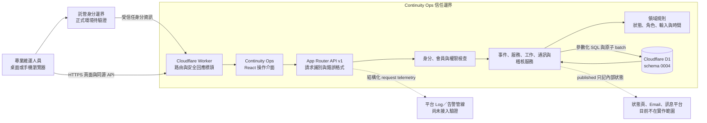

# Continuity Ops 系統環境、元件與責任邊界

文件版本：`1.0.0`  
狀態：依目前原始碼與設定整理的 `source_confirmed` 架構。正式託管身分、Log 管線及生產 D1 尚未驗證。

## 1. 系統環境

虛線表示規劃中的外部能力，不表示已完成整合。正式環境的受信任身分資訊只能由受保護的 identity edge 加入；直接由一般用戶端提供相同 header 不能被視為可信。

## 2. 元件責任

| 元件 | 主要責任 | 不負責的事項 | 原始碼或設定 |
|---|---|---|---|
| 操作介面 | 顯示總覽、事件、服務、稽核與存取管理；依權限顯示操作；保存網址狀態；提供確認與錯誤回饋。 | 不能成為授權或資料不變條件的唯一保護。 | `app/operations/OperationsApp.tsx`、`app/globals.css` |
| Worker 邊緣入口 | 將請求交給應用程式、處理圖片、補上 CSP、frame、MIME、referrer、permissions 等回應標頭。 | 不在原始碼中驗證託管身分 header 的上游防偽設定。 | `worker/index.ts` |
| API 路由 | 產生 request ID、統一 dispatch、回傳 JSON 或 RFC 7807 問題、發出不含 payload 的 request telemetry。 | telemetry 發出不代表已被收集、保存或告警。 | `app/api/v1/[...path]/route.ts`、`app/api/v1/_shared.ts` |
| 身分與權限 | 區分本機明確設定與正式 forwarded identity；查詢會員；檢查組織權限及事件角色。 | 已驗證身分不等於自動受邀；前端顯示不等於授權。 | `lib/operations-auth.ts`、`db/operations.ts`、`lib/operations-domain.ts` |
| API handlers | 驗證輸入、查詢資源關係、套用領域規則、組成 D1 batch、建立時間軸與稽核。 | 不直接傳送外部狀態頁、Email 或訊息。 | `app/api/v1/_handlers.ts`、`app/api/v1/_data.ts` |
| 領域規則 | 定義角色、權限、狀態、允許轉換、證據 URL、文字邊界、時間與 route template。 | 不能代替資料庫面對並行或直接 SQL 的保護。 | `lib/operations-domain.ts`、`lib/operations-time.ts` |
| D1 資料層 | 保存組織、服務、事件與協作資料；用外鍵、check、index、trigger 及 batch 保護資料一致性。 | 不能驗證 HTTPS 連結指向的外部內容是否真實，也不能自動證明備份可還原。 | `drizzle/0001_continuity_ops_v2.sql` 至 `drizzle/0004_service_lifecycle_accountability.sql` |
| 證據與建置 | 執行 smoke、負例、故障注入、migration、manifest 與建置查核。 | 測試檔存在不等於已在目前版本執行；本機結果不等於生產結果；子目錄 workflow 不會由目前上層 Git root 自動觸發。 | `tests/`、`scripts/`、`evidence/`、`.github/workflows/ci.yml` |

## 3. 實際部署單元

目前建置將 React 應用、App Router API 與 Worker 入口包成 Cloudflare Worker 相容產物，靜態資產由 `ASSETS` 提供，持久資料由 `DB` D1 binding 提供。`.openai/hosting.json` 宣告 D1 migration 交付；本機使用 `wrangler.local.jsonc` 與隔離的 `.wrangler` 狀態。

每份本機驗證只說明其明確綁定的 artifact、Log 或 migration 與本機 D1 行為。現有本機 API／安全 smoke 綁定 2.2.0 Worker SHA-256 `1d8b2d0c99000fb1d6b58b23de97adadba06210f370ddcb03e41c95468cf9158`；71/71 項 API 檢查在隔離本機 D1 通過，同一 digest 也有桌面及手機尺寸的內部瀏覽器核對。正式部署還必須另行確認：identity edge、HTTPS domain、環境變數、deployment version、遠端 migration、Log 收集、告警、備份、容量與 rollback owner。

## 4. 信任與資料邊界

| 邊界 | 進入資料 | 必要檢查 | 失敗時 |
|---|---|---|---|
| 瀏覽器到 Worker | URL、method、Origin、JSON、Idempotency-Key | 同源 mutation；串流累計實際 bytes、不信任 `Content-Length` 的 32 KiB 上限；有效 UTF-8 JSON object；欄位長度、URL／時間格式 | 超限時取消讀取並回傳 413；其他不合法輸入回傳 problem JSON 與 request ID，不執行寫入。 |
| 身分邊界到應用程式 | 已驗證 Email 與顯示名稱 | 正式來源、Email 正規化、啟用使用者、啟用會員與啟用組織 | 401 或 403；未知身分不自動建立會員。 |
| 組織角色到事件角色 | 組織權限、事件指派 | 兩層授權同時成立；高風險角色另外限制 | 403 並在可信 actor 已建立時留下不含 payload 的拒絕稽核。 |
| API 到 D1 | 參數化資料、expectedVersion、冪等資訊 | 外鍵、check、unique、version、transition、append-only 與原子 batch | 整批失敗；API 對可辨識錯誤回傳穩定問題代碼。 |
| 產品到平台 Log | route template、method、status、problem code、latency、版本 | 不含資源 ID、body、token、cookie、授權 header 或自由文字 | Log 發送失敗不得改變原 API 回應；需由平台另行告警。 |
| 產品到外部連結 | Runbook 或證據 HTTPS URL | 只檢查可保存的 HTTPS 格式 | 不宣稱已擷取、掃描或驗證連結內容。 |

## 5. 架構一致性查核

委員或 QA 可選一個核心操作，依序核對：

1. 介面呼叫的實際 endpoint；
2. route handler 產生的 request ID 與問題格式；
3. 身分、組織權限與事件角色；
4. handler 的輸入、資源關係與 `expectedVersion`；
5. D1 batch、table、trigger 及稽核列；
6. 回應資料與介面重新載入後的狀態；
7. 對應驗收契約、測試與證據限制。

任何圖上的元件若無法在原始碼、migration、設定或執行紀錄中找到，就不能只靠圖表主張架構已實作。
