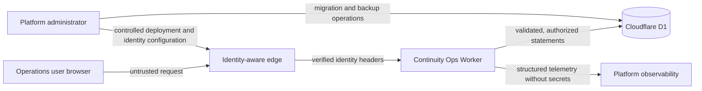

# Continuity Ops 安全模型

版本：`2.2.0`

狀態：`design baseline / independent review pending`

本文說明目前的資產、行為者、信任邊界、主要威脅、預期控制與尚待驗證項目。它不是獨立資安查核、滲透測試報告、隱私核准或 OWASP ASVS 符合性聲明。

介面與互動的設計依據見 [產品設計基準](product-design.md)。本安全模型與伺服器端契約優先於前端提示或顯示狀態。

## 1. 安全目標

1. 只有經驗證且具有適當角色的人能讀寫受限資源。
2. 每個重要操作可追溯到人、時間、資源、版本、請求與結果。
3. 事件時間軸、安全稽核與平台遙測分開，避免用分析同意或介面狀態代替安全控制。
4. 影響權限、事件狀態、結案或重新開啟的規則由伺服器端與資料庫共同執行；本版沒有資料匯出端點。
5. 系統不保存或執行生產環境憑證與指令；事件紀錄不得成為憑證傳播管道。

## 2. 範圍與信任假設

- 一次部署只服務一個組織。本版不宣稱完成多租戶隔離。
- 正式環境的身分來自部署平台已驗證並且無法被公開用戶端偽造的 header。若邊緣層不能保證這項條件，身分模型不成立，不得上線。
- 本機身分只在 hostname 為 localhost／127.0.0.1，且 `CONTINUITY_OPS_ENVIRONMENT=development` 時允許。
- `CONTINUITY_OPS_BOOTSTRAP_ADMIN_EMAIL` 是初始管理員識別設定，不是密碼。必須比對平台已驗證 email，不接受請求內容或一般用戶端自報 email。
- 正式環境先查既有會員資格。既有 `admin` 由系統管理，不會出現在自選角色中；既有使用者或會員若為 `suspended`，維持停用且不走自動建立流程。正規化後 Email 網域精確為 `ntub.edu.tw` 的已驗證帳號，首次登入先建立唯讀會員，之後可在登入流程選擇 `commander`、`responder`、`observer` 或 `auditor`。角色切換需通過版本與啟用中事件指派相容性查核。其他網域未受邀帳號回傳 403。身分無效時不使用不可信 header 建立稽核 actor。
- D1、Worker 與 identity proxy 均需有明確 owner。組織的外部狀態頁、Email 與訊息平台目前未連接 Continuity Ops，屬於系統外部的營運管道，不納入已實作控制。

## 3. 主要資產與分級

| 資產 | 範例 | 建議分級 | 重要保護 |
|---|---|---|---|
| 使用者身分與角色 | 平台 subject、email、display name、事件角色 | Restricted | 信任來源、最小權限、撤銷、稽核 |
| 服務目錄 | 服務、owner、負責團隊、SLO、Runbook 連結、生命週期變更原因／操作者／時間 | Internal/Restricted | 讀寫權限、版本衝突、變更追溯、敏感連結管理、生命週期證據不可單獨改寫 |
| 營運事件 | 影響、假說、處置、工作完成證據、結構化通訊、驗證、事後改善 | Restricted | 角色權限、版本衝突、狀態限制、輸入限制、證據參考連結管理 |
| 追加式稽核 | actor、action、resource、result、request ID、時間 | Restricted/Security | 一般應用不可修改、保存政策、監控 |
| 平台遙測 | 錯誤碼、延遲、trace、資源使用 | Internal/Security | 資料最小化、敏感值排除、保存期限 |
| 部署身分與設定 | Worker、D1、identity proxy、bootstrap admin email | Restricted/Security | 平台權限、變更核准、不寫入前端或 repository |

## 4. 行為者與權限意圖

授權分為兩層。組織存取角色為 `admin`、`commander`、`responder`、`observer` 與 `auditor`；單一事件的任務指派為 `incident_commander`、`responder`、`communications_lead`、`service_owner` 與 `observer`。`admin` 是唯一不需要事件指派的全域寫入例外。其他事件寫入必須同時通過組織角色、該事件啟用中指派及兩者相容性的查核；事件角色本身不會擴張組織權限。`observer` 與 `auditor` 可讀營運總覽、全部事件、服務、稽核及自己的存取政策，但不能取得成員目錄；所有 `POST`、`PUT`、`PATCH` 與 `DELETE` 均須由伺服器拒絕。

相容矩陣為：`admin` 可承擔所有事件角色；`commander` 可承擔 `incident_commander`、`communications_lead` 或 `observer`；`responder` 可承擔 `responder`、`communications_lead`、`service_owner` 或 `observer`；`observer` 與 `auditor` 只能承擔 `observer`。通訊草稿允許具合格指派的 `commander` 或 `responder` 編輯；`responder` 只有在具有 `communications_lead` 指派時才能核准及標記發布。即使資料中出現不相容指派，`observer` 與 `auditor` 仍不得寫入。

| 行為者 | 允許的責任 | 不應允許 |
|---|---|---|
| Incident commander | 在組織角色同時允許時，指派事件角色、控制高風險狀態、確認解決／重開與維護事後檢討 | 修改或刪除既有稽核記錄 |
| Responder | 調查、提出假說、記錄處置與結果 | 自行結案、擴權或修改他人身分 |
| Communications lead | 在組織角色與事件指派同時允許時建立及編輯通訊草稿；有效的溝通負責人指派也可核准及標記發布 | 把系統內 `published` 當成外部送達、改變技術處置、事件狀態或授權 |
| Service owner | 在組織角色為 `responder` 且被指派至事件時參與調查與處置 | 因事件角色而取得服務目錄寫入權限 |
| Service catalog maintainer | `admin` 或 `commander` 依 `service:write` 維護服務、SLO、owner、Runbook 連結與生命週期 | 淘汰仍有未結案事件的服務或變更既有 slug |
| Observer／Auditor | 只讀查看營運總覽、全部事件、服務、稽核紀錄及自己的存取政策 | 執行營運寫入、查看成員目錄、查看 actor email、變更權限、清除證據或使用尚不存在的匯出 API |
| Platform administrator | 管理部署、身分整合與資料庫 | 未留下變更紀錄的臨時擴權 |

介面上隱藏或停用控制不是授權。API 必須依已驗證使用者、組織、資源、事件角色、目前狀態與請求版本重新判斷。

## 5. 信任邊界

1. Browser → identity edge：請求、header、URL、查詢參數、body 與客戶端顯示狀態均不可信；深層連結不能授予權限。
2. Identity edge → Worker：只有邊緣層能清除外部同名 header 並加上已驗證身分時才可信任。
3. Worker → D1：每個寫入需驗證來源、授權、資源關係、狀態、版本、長度與允許值。
4. Worker → observability：不記錄身分 token、cookie、authorization header、request body、憑證或未審查原文。
5. Administrator → platform：部署、migration、身分整合與備份屬於高風險操作，需具名變更、最小權限與復核。

## 6. 威脅、控制與待驗證項目

| 威脅 | 必要控制 | 證據要求／目前限制 |
|---|---|---|
| 偽造身分 header | 邊緣層剝除外部同名 header；Worker 只信任核准來源 | 需遠端設定與負例證據；目前不宣稱已部署 |
| 本機身分誤用於遠端 | 同時檢查 environment 與 localhost；staging／production 不定義 local operator | 需單元、API 與部署設定負例 |
| 水平／垂直越權 | 每個資源伺服器端查核目前組織角色、啟用中成員資格與事件指派；角色選擇只允許四種非管理員角色，並查核版本與進行中的責任 | 單元與隔離本機 Worker／D1 已核對角色清單、管理員排除與兩次角色切換；完整角色／事件責任矩陣與正式身分邊界仍待查核。服務目錄寫入目前不是 owner-scoped |
| Email 網域或角色選擇判定錯誤 | 僅接受正規化後網域精確為 `ntub.edu.tw` 的有效 Email；`admin` 不列入自選值；`suspended` 狀態不自動恢復，其他網域未受邀者回傳 403 | 單元與隔離本機 Worker／D1 已核對精確網域、並行首次登入、管理員排除、既有 admin、其他網域及一筆 suspended 會員；正式 edge、實際第二個 NTUB 帳號與其餘身分組合仍待查核 |
| 唯讀帳號取得不必要個資 | 校內唯讀帳號的存取政策只回傳本人資料，不回傳成員目錄；稽核頁不顯示 actor email，`admin` 才保留該欄位 | 隔離本機 Worker／D1 已核對成員目錄 403 與唯讀稽核省略 actor email；正式 edge 的實際第二個 NTUB 帳號、admin actor email 與瀏覽器畫面仍待查核 |
| 重送或競態造成雙重寫入 | Idempotency-Key、request hash、24 小時回執、資料庫唯一性、optimistic version 與同批次寫入 | 已實作相同 payload replay、不同 payload 拒絕及有界過期清理；仍需遠端並行、重送與中途失敗測試 |
| 分頁 cursor 被竄改或跨服務重用 | 生命週期 cursor 採 HMAC-SHA256 簽章，並將服務 ID 與組織 ID 納入簽章內容；拒絕非正規編碼、錯誤簽章、錯誤範圍及過長輸入 | secret 至少 32 字元且缺漏時 fail closed；真實值只能放在平台 secret，不得進入 repository、Log、遙測或 evidence artifact；輪替會使既有 cursor 失效 |
| 稽核記錄被修改或與業務結果不一致 | 成功寫入將回執、業務變更、時間軸與稽核納入同一 D1 batch；資料庫 trigger 禁止更新或刪除稽核與時間軸 | 被拒絕的 mutation 在原交易失敗後以 best-effort 另寫稽核；若失敗則只發出結構化錯誤 telemetry，因此需告警與故障注入驗證 |
| 未核准通訊被標記發布，或系統內狀態被誤認為外部送達 | `draft → reviewed → published` 狀態順序、角色與版本查核、已核准內容不可改寫、已發布紀錄不可變、外部受眾更新時間限制及終止事件禁止發布 | 事件狀態、角色、工作、成員存取、服務生命週期與通訊已有相稱的確認或風險提示。本版沒有外部狀態頁、Email、訊息平台或送達回執整合 |
| 服務遙測缺漏卻顯示為正常 | API 在未接入遙測時回傳 unknown／unavailable／sample size 0／null SLO；前端遇到 unavailable 時強制顯示未知 | 尚未接入真實服務健康遙測，需以遠端資料來源、缺漏及異常格式測試確認 fail closed |
| 敏感資料進入事件原文或 Log | 欄位最小化、型態與長度限制、控制字元正規化、使用者告知與人工審查 | 系統不會辨識所有憑證或個資，也沒有原始 Log 上傳／匯出端點；需隱私與資料治理核准 |
| 前端程式注入 | React 預設 escaping、禁止任意 HTML、CSP、輸入與輸出驗證 | vinext hydration 目前保留 `unsafe-inline` script/style 相容性；這是待以 nonce/hash 減少的殘餘風險 |
| 前端被嵌入或跨來源資源濫用 | `frame-ancestors 'none'`、`X-Frame-Options: DENY`、同源 CORP/COOP、最小 Permissions Policy | 需在實際 domain 及主要瀏覽器驗證 |
| 端點被濫用或資源耗盡 | 邊緣 rate limiting、請求大小限制、分頁、作業配額與告警 | 尚需實作與壓力／濫用測試證據 |
| 相依或建置來源被篡改 | lockfile、`npm ci`、相依審計、不可變 artifact、digest、CI 最小權限；已有專案文字來源秘密掃描器及 lockfile 型 CycloneDX SBOM 產生器 | 本機 scanner 的 known-good／known-bad／排除／fail-closed 案例及一次專案掃描已完成，SBOM 已產生；仍需在凍結候選版重跑，且尚無遠端 CI、Git history／binary 秘密掃描、SAST、DAST、artifact provenance、獨立查核與發布簽核 |
| 備份無法還原或回復破壞資料 | 備份 digest、隔離還原、expand/contract migration、上一個已驗證 artifact | 已完成一次合成本機 D1 logical export/import 並核對 migration、逐表筆數、marker、foreign key 與備份雜湊；尚無遠端／production 還原、真實資料量、artifact rollback、RTO 或 RPO 證據 |

目前由資料庫與 API 共同維持的關鍵條件包括：

- 服務 slug 建立後不可修改；服務可在 `active` 與 `deprecated` 間變更，但仍有未結案事件時不得淘汰。
- 指派撤銷採 `revoked` 軟撤銷並保存 `endedAt` 與 `endedByUserId`。最後一位事件指揮官只能在同一批次建立或確認合格接任者後撤銷。
- 最後一位啟用中的 `admin` 不得被停用、降級或刪除；仍是未結案事件唯一指揮官的成員，也不得先停用或降級再處理交接。
- 成員更新必須帶入目前 `expectedVersion`，資料庫要求版本逐次增加；並行管理操作不能以最後寫入者靜默覆蓋先完成的決定。
- `monitoring → resolved` 需要非空白復原判定條件、進入本次 `monitoring` 後建立的 `verification` 時間軸紀錄，以及沒有未完成或未取消的 `critical` 工作。重新進入 `investigating` 會清除本次監控起點，因此舊週期證據不能滿足下一輪條件。
- 事後檢討僅能在 `resolved`／`closed` 保存為 `draft` 或 `completed`；完成版需有六個必要段落。事件重新開啟時，完成版會回到草稿並留下時間軸與稽核。
- 驗證時間軸以固定欄位保存 HTTPS reference、source label、觀測時間窗與選填 SHA-256 digest。它提供 Log／監控證據的索引與完整性線索，不表示系統已讀取或驗證外部內容。
- 工作建立及未完成狀態可不填證據；改為 `completed` 前，API 與 D1 都要求具有主機名稱的 HTTPS reference。`critical` 工作取消時需要 8–1000 字理由；原工作為 `critical` 時不能在同一更新先降級再略過理由，已保存的理由也不能移除或改寫。系統只保存網址與理由，不擷取或驗證外部內容，且工作狀態不能單獨證明成果正確。
- 通訊必須先建立為 `draft`，再依序變更為 `reviewed` 與 `published`。已核准內容不得改寫，已發布紀錄不得更新或刪除；利害關係人與公開通訊在核准前必須安排未來更新時間，或從第一個字元使用大小寫不拘的獨立 `[FINAL]` 標記，且標記後必須是空白或訊息結束。發布時再次確認排程仍在未來；`resolved`、`closed` 或 `cancelled` 事件不得再標記發布。
- 組織 IANA 時區保存於 D1 並由 API 傳回。顯示與地方時間輸入使用同一時區；缺漏或無效值採 UTC，日光節約時間中不存在或重複的地方時間會被拒絕。

## 7. HTTP 安全基準

Worker 目前在 source 中為應用回應設定：

- `Content-Security-Policy`：同源預設、禁止 object 與 framing、限制 form、image、font、media、connect、worker 及 manifest 來源。
- `Strict-Transport-Security`：只在 HTTPS 回應使用。
- `X-Content-Type-Options: nosniff`、`X-Frame-Options: DENY`、`Referrer-Policy: no-referrer`。
- 同源 `Cross-Origin-Opener-Policy` 與 `Cross-Origin-Resource-Policy`。
- 關閉目前不需要的 camera、microphone、geolocation、payment 與 USB 能力。
- API 與 HTML 回應使用 `Cache-Control: no-store`，避免受限頁面被共用快取。

前端只將 `view`、`incident` 與 `tab` 寫入查詢參數，用於還原畫面位置與瀏覽器導覽。查詢參數仍是不可信輸入，不得承載秘密或個人資料；每個 API 請求都必須重新執行身分、組織、事件與資源授權。

目前 CSP 為了 vinext hydration 相容仍允許 inline script/style；尚未完成 nonce／hash 收斂。所有標頭仍需在建置後 bundle、staging 與主要瀏覽器實際驗證。單純在 source 出現字串不能證明遠端生效。

## 8. 稽核與遙測要求

安全稽核事件目前保存：

- server-generated event ID 與 request ID；
- 已驗證 actor ID、當時角色與組織；
- action、resource type、resource ID，以及部分變更的前後版本；
- success／denied／failure、穩定 reason code 與伺服器時間；
- 不含 cookie、token、authorization header 或 request body 的有界 details metadata。

稽核資料在資料層保留可歸責 actor；對 `observer` 與 `auditor` 的稽核回應及畫面不提供 actor email，`admin` 仍可查看。存取政策對唯讀角色只回傳本人政策，不提供成員目錄。這些欄位限制必須在伺服器端投影，不能只靠前端隱藏。

每個 API 回應另以單行 JSON 發出 request telemetry，欄位為固定 event name、request ID、無使用者資源識別碼的 route template、HTTP method／status、problem code、latency、API version、schema version 與 deployment version。無效身分或被政策拒絕的未受邀身分只留下這類無 actor 原文的 request telemetry，不使用未驗證 header 建立稽核 actor。若 `CONTINUITY_OPS_DEPLOYMENT_VERSION` 未設定，`deploymentVersion` 會是 `unversioned`；staging 與 production 應將它列為發布停止條件。

拒絕的越權事件、系統失敗與使用者操作失敗必須分開統計。受控測試、staging 與 production 也必須分開，不得以合併指標掩蓋實際使用者影響。

## 9. 保存、匯出與刪除

- 每種資料需有 owner、目的、分級、保存期限、刪除方式與合法／組織依據。
- 稽核記錄的保存政策不得由一般使用者選擇性分析設定決定。
- 本版沒有資料匯出 API。日後若加入匯出，必須先定義權限、目的、範圍、稽核、快取禁止與人工審查，不得把 auditor 的讀取權限當成既有匯出能力。
- 自由文字無法保證已去識別；僅以字串規則過濾不足以支持「不含個資」的聲明。
- 一般事件、稽核與時間軸尚無自動保存期限工作。只有冪等回執設定 24 小時有效期，並在後續冪等寫入時每次有界清除最多 100 筆同組織過期回執；這不構成完整保存與刪除制度。
- 保存期限工作、失敗告警與刪除證明必須在正式部署前驗證。

## 10. 參考基準與聲明限制

- [NIST SP 800-61 Rev. 3](https://csrc.nist.gov/pubs/sp/800/61/r3/final)：作為網路安全事件應變與風險管理參考。
- [Google SRE Incident Management Guide](https://sre.google/resources/practices-and-processes/incident-management-guide/)：作為事件角色、協調、溝通、控制與事後學習參考。
- [OWASP ASVS 5.0.0](https://github.com/OWASP/ASVS/releases/tag/v5.0.0_release)：作為應用程式安全驗證要求參考。引用個別要求時應使用含版本的 ID。
- [W3C WCAG 2.2](https://www.w3.org/TR/WCAG22/)：作為完整頁面與流程的可及性目標參考。

「參考」不代表已滿足所有要求。任何安全、隱私、可及性或事件應變符合性聲明，必須附上固定版本、適用範圍、驗證人員、方法、原始結果、排除項目與未解決限制。
